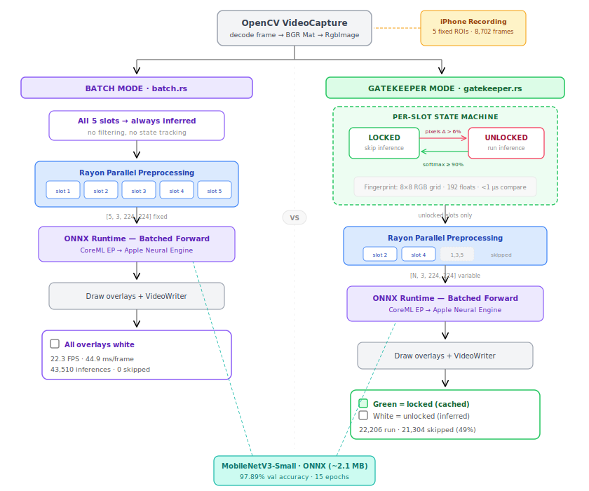
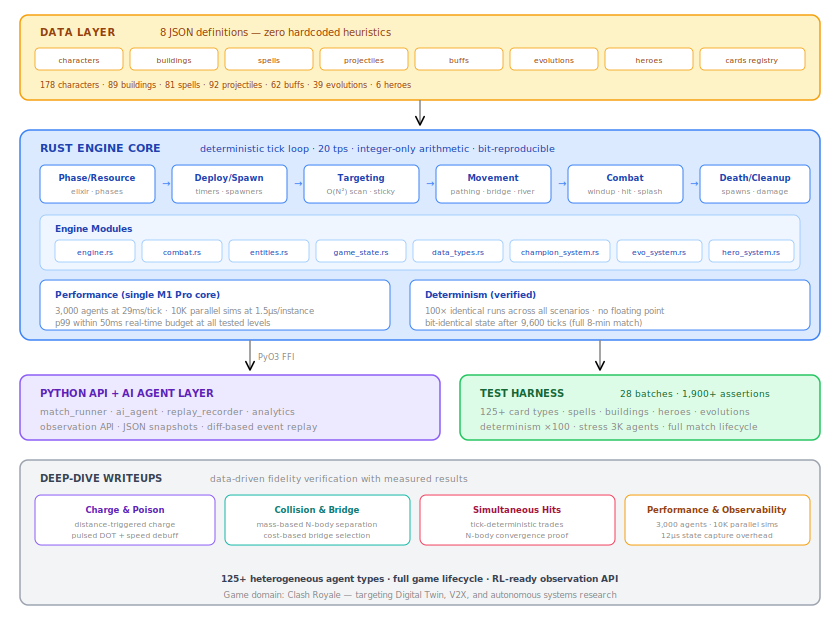

# Clash Royale Autonomous Intelligence & High-Performance Systems Suite

A research-oriented framework combining high-performance systems programming and deep learning to build a real-time autonomous decision agent.

## 🚀 Key Technical Pillars

* **[High-Performance System Programming (Rust)](https://nguiasoren.github.io/clash-royale-suite/cr-data-engine/data_engine_writeup.html):** Engineered a high-speed data processing engine in **Rust** to perform bit-level deduplication and temporal redundancy filtering on a **440,000-frame dataset**, achieving a 10x performance increase over Python-based alternatives and a 61% dataset reduction through zero-copy memory management and multi-threaded I/O.
* **[Real-Time Neural Perception Pipeline:](https://nguiasoren.github.io/clash-royale-suite/cr-perception/card-classifier/inference_pipeline_overview.html)** For card classification in Clash Royale gameplay; rewrote the full video inference pipeline from Python/PyTorch to Rust — replacing per-card sequential inference with batched ONNX Runtime forward passes, parallelizing ROI preprocessing via rayon work-stealing threads, and targeting platform-native acceleration (CoreML/ANE) — achieving ~9ms per-card inference and 22 FPS throughput over 8,702 frames (43K+ classifications).
* **[Stateful Inference Gatekeeper:](https://nguiasoren.github.io/clash-royale-suite/cr-perception/card-classifier/inference_pipeline_overview.html)** Architected a per-slot state machine in Rust that pre-filters card slots before downstream inference. Uses sub-microsecond pixel fingerprinting (8×8 sampled grid) to detect visual changes, locking slots at ≥90% classification confidence and skipping inference until pixel divergence is detected — eliminating 49% of inference calls (21K of 43K) across a live match, targeting real-time and cost-constrained deployment scenarios.
* **[Deterministic Simulation Framework:](cr-rudy-sim/simulator/README.md)** Engineered a high-throughput real-time simulation engine in Rust deterministic tick loop (20 tps, integer-only arithmetic) modeling 125+ heterogeneous agent types from data-driven JSON definitions. Stress-tested to **3,000 concurrent agents** at 29 ms/tick (within 50 ms real-time budget) on a single M1 Pro core. Measured **10,000 parallel simulation** instances at 23.7 ms batch latency (1.5 μs/instance), demonstrating linear scaling with no cache degradation. Built a full observability pipeline: per-tick state capture at 12 μs overhead, diff-based event reconstruction, and JSON-serializable snapshots for downstream data pipelines. Game domain: Clash Royale combat mechanics.
* **Generative Data Engineering:** Utilized **Super-Resolution (Real-ESRGAN)** to enhance low-fidelity API assets to $1200\text{px}$, followed by a 4-stage augmentation pipeline (radial loading, 8-directional occlusion, domain-invariant compositing) to synthesize a **295k+ image training set**.

<!-- ═══ INFERENCE PIPELINE SECTION ═══ -->

### [Real-Time Inference Pipeline →](https://nguiasoren.github.io/clash-royale-suite/cr-perception/card-classifier/inference_pipeline_overview.html)

Two Rust binaries, same model — different strategies for when to run inference. **Batch mode** classifies all 5 card slots every frame. **Gatekeeper mode** tracks pixel-level changes per slot and skips inference on cards that haven't changed.

| | Batch Mode | Gatekeeper Mode |
|---|---|---|
| **Throughput** | 22.3 FPS | 11.6 FPS |
| **Inferences/frame** | 5 (fixed) | 0–5 (variable) |
| **Inferences skipped** | 0 | 21,304 (49%) |
| **Overlay color** | White (all slots inferred) | Green = locked (cached), White = unlocked |

#### Batch mode — all overlays white, every slot inferred every frame

<table>
<tr>
<td width="33%"><video src="https://github.com/user-attachments/assets/e869e69b-d055-49ce-9bf2-c193fcf846eb" controls width="100%"></video></td>
<td width="33%"><video src="https://github.com/user-attachments/assets/fa5cef9b-18c6-49e6-918d-63eb2224b1c6" controls width="100%"></video></td>
<td width="33%"><video src="https://github.com/user-attachments/assets/402b80de-c4b6-4f6e-82b4-d607ad4a5c89" controls width="100%"></video></td>
</tr>
<tr>
<td align="center">Batch Track 1</td>
<td align="center">Batch Track 2</td>
<td align="center">Batch Track 3</td>
</tr>
</table>

#### Gatekeeper mode — green borders = inference skipped, white = inference running

<table>
<tr>
<td width="33%"><video src="https://github.com/user-attachments/assets/a3843b9f-512e-4940-8874-01b35d492f02" controls width="100%"></video></td>
<td width="33%"><video src="https://github.com/user-attachments/assets/9b073c9b-8dc6-4d94-9411-87d7b6c65136" controls width="100%"></video></td>
<td width="33%"><video src="https://github.com/user-attachments/assets/e100ea60-4cf4-43b4-9e81-7deadf61da4c" controls width="100%"></video></td>
</tr>
<tr>
<td align="center">Gatekeeper Track 1</td>
<td align="center">Gatekeeper Track 2</td>
<td align="center">Gatekeeper Track 3</td>
</tr>
</table>

> **Why is gatekeeper slower for offline video?** CoreML compiles optimized execution plans for fixed tensor shapes. Batch mode sends a consistent `[5, 3, 224, 224]` every frame — compiled once, runs on the ANE. Gatekeeper varies the batch size dynamically, forcing recompilation. The gatekeeper targets **live real-time streams** where skipping 49% of inference calls saves compute, not batch processing.

📄 **[Full writeup →](https://nguiasoren.github.io/clash-royale-suite/cr-perception/card-classifier/inference_pipeline_overview.html)** — architecture details, model training history, systems optimizations (Python → Rust), and build instructions.

<!-- ═══ SIMULATOR SECTION (paste into top-level README.md) ═══ -->

### Deterministic Multi-Agent Simulator

A tick-deterministic, integer-only combat simulation engine in Rust, modeling 125+ heterogeneous agent types from 8 data-driven JSON definitions. Exposes a Python API via PyO3 for AI agent integration, replay recording, and RL training pipelines.

| Metric | Value |
|---|---|
| **Agent types modeled** | 178 characters, 89 buildings, 81 spells, 92 projectiles |
| **Tick rate** | 20 tps (50ms budget), integer-only arithmetic |
| **Stress test** | 3,000 concurrent agents at 29ms/tick (single M1 Pro core) |
| **Parallel sims** | 10,000 instances at 23.7ms batch latency (1.5μs/instance) |
| **Determinism** | 100× identical runs, bit-identical after 9,600 ticks |
| **Test coverage** | 28 batches, 1,900+ assertions, ~95% pass rate |

> **Engine subsystems tested:** attack timing (windup/backswing state machine), splash damage, charge mechanics (Prince/Dark Prince/Battle Ram), shield absorption, death spawns (Golem→Golemites, Lava Hound→Pups), building spawners (Witch, Tombstone, Furnace), champion abilities (Skeleton King graveyard, Archer Queen rapid fire, Monk deflect, Golden Knight dash, Mighty Miner lane switch), evolution abilities (Evo Knight passive shield, Evo PEKKA heal-on-kill), spell interactions (Freeze, Rage, Poison DOT, Tornado pull, Lightning top-3 targeting), projectile mechanics (homing, multi-projectile Hunter/Princess, chain lightning E-Dragon), collision separation (mass-based N-body), bridge pathing, river jumping, and full match lifecycle (regular → double elixir → overtime → sudden death).

#### Deep-dive writeups

| Writeup | Focus |
|---|---|
| [**Charge & Poison Modeling →**](https://nguiasoren.github.io/clash-royale-suite/cr-rudy-sim/22_charge_and_poison_writeup.html) | Distance-triggered charge activation, pulsed DOT with movement debuff |
| [**Collision & Bridge Pathfinding →**](https://nguiasoren.github.io/clash-royale-suite/cr-rudy-sim/27_collision_and_bridge_writeup.html) | Mass-based N-body collision separation, cost-based bridge selection |
| [**Simultaneous Hits & Convergence →**](https://nguiasoren.github.io/clash-royale-suite/cr-rudy-sim/28_simultaneous_hits_and_collision_writeup.html) | Tick-deterministic trade resolution, collision convergence proof |
| [**Performance & Observability →**](https://nguiasoren.github.io/clash-royale-suite/cr-rudy-sim/29_performance_observability_writeup.html) | Scaling to 3,000 agents, 10K parallel sims, 12μs state capture |

## 📂 Repository Structure

* `cr-perception/`: Hand-card classification — MobileNetV3 training, Rust inference pipeline (batch + gatekeeper), ONNX/CoreML deployment.
* `cr-data-engine/`: Dataset sanitization (Rust temporal deduplication engine), super-resolution upscaling (Real-ESRGAN), 4-stage augmentation suite.
* `cr-rudy-sim/`: Deterministic Rust simulator — tick engine, PyO3 Python API, 28 test batches, champion/evolution systems.
* `data/`: (Symlinked/Local) 309GB dataset storage (excluded from VCS via `.gitignore`).

## 🛠 Roadmap

- [x] High-accuracy hand-card state extraction (97.89%, 175 classes)
- [x] Rust inference pipeline with stateful gatekeeper (22 FPS, 49% inference reduction)
- [x] Temporal deduplication engine (440K frames, 61% reduction, 221 FPS)
- [x] Deterministic simulation engine (3K agents, 10K parallel sims, 1,900+ test assertions)
- [ ] Self-play RL training at scale (millions of simulated matches via Rayon parallelism)
- [ ] Imitation learning from top-ladder player replays
- [ ] Real-time troop/spell localization (YOLOv11)
- [ ] Strategy evaluation against top-player meta

